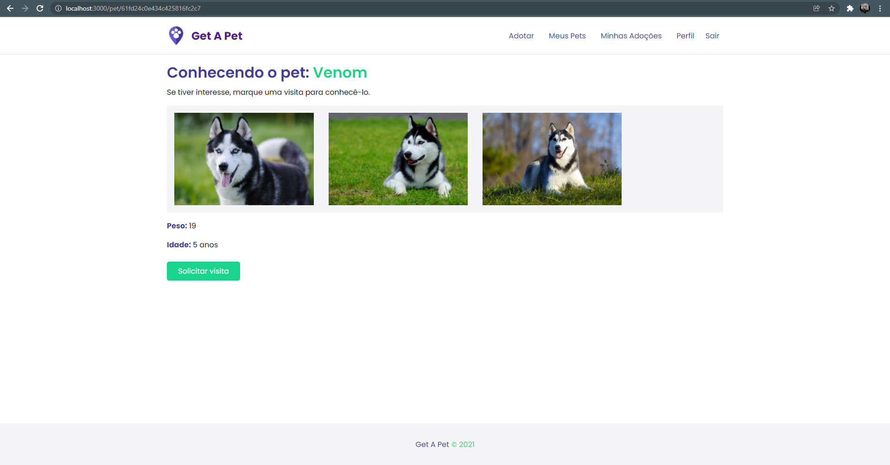

## Get A Pet

Get A Pet is a fullstack application, where the user registers to adopt a pet, and even register their pets available for adoption.

---

### Home page


### Pet page



---

## Technologies

<div style="display: inline_block">
  <a href="https://reactjs.org/" target="_blank">
    
  </a>
  <a href="https://nodejs.org/" target="_blank">
    
  </a>
  <a href="https://expressjs.com/" target="_blank">
    
  </a>
  <a href="https://www.mongodb.com/" target="_blank">
    
  </a>
</div>

---

## Getting started

### Requirements

- You need to install both [Node.js](https://nodejs.org/en/download/), [Yarn](https://yarnpkg.com/) and [MongoDB](https://www.mongodb.com/) to run this project.

**Clone the project**

```bash
$ git clone https://github.com/brunomart97/get-a-pet.git
```

**Follow the steps**

```bash
# Access the backend folder
$ cd backend

# Install backend dependencies
$ yarn

# Run the backend
$ yarn start

# Access the frontend folder
$ cd frontend

# Install frontend dependencies
$ yarn

# Run the frontend
$ yarn start
```

The application will be available at `http://localhost:3000`\
Remember to create a database called getapet in MongoDB

---

### Author

<p>
  
  <br />
  <sub><strong>Bruno Martins da Silva</strong></sub>
</p>

<a href="https://www.linkedin.com/in/brunomart97" target="_blank">
  
</a>
